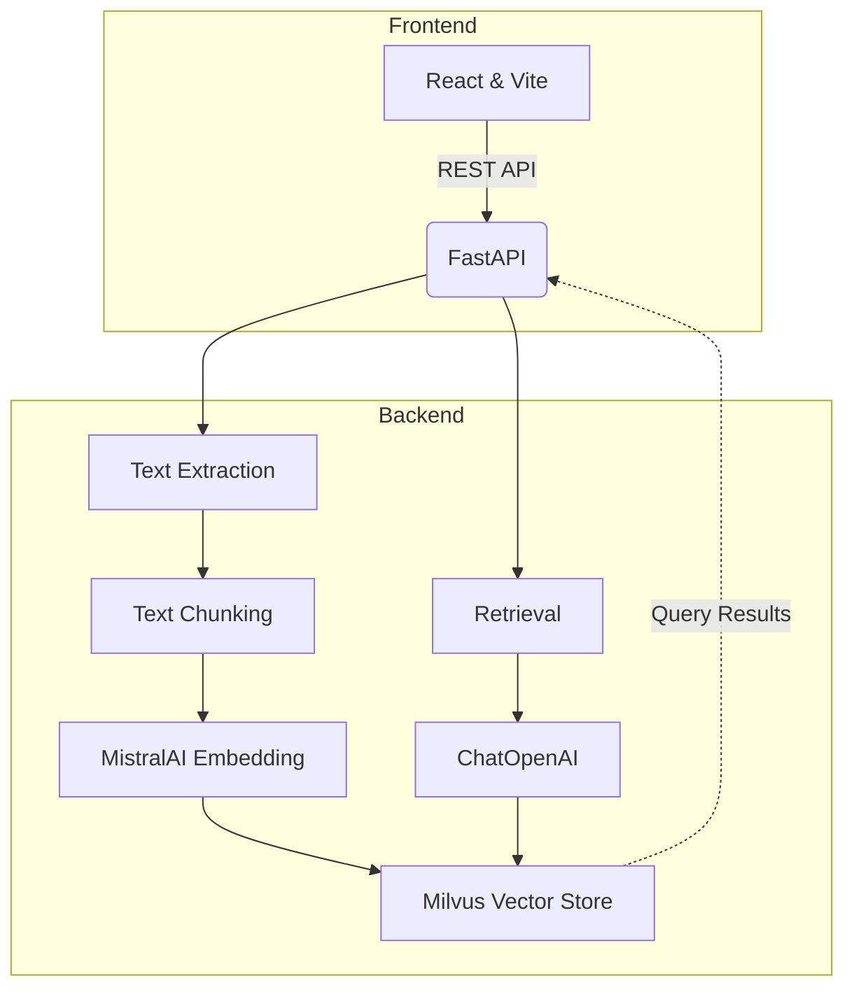

# ChatDoc

[](https://github.com/0xarchit/chatdoc/stargazers)


> A unified retrieval-augmented generation (RAG) document API and web interface, powered by FastAPI, React, Vite, Milvus, and MistralAI.

## Table of Contents
1. [Overview](#overview)
2. [Architecture](#architecture)
3. [Features](#features)
4. [Tech Stack](#tech-stack)
5. [Getting Started](#getting-started)
   - [Prerequisites](#prerequisites)
   - [Backend Setup](#backend-setup)
   - [Frontend Setup](#frontend-setup)
   - [Docker (Optional)](#docker-optional)
6. [API Reference](#api-reference)
7. [Architecture Diagram](#architecture-diagram)
8. [Contributing](#contributing)
9. [License](#license)

## Overview
ChatDoc is a web application enabling users to upload documents, extract and chunk text, store embeddings in Milvus, and query with state-of-the-art LLMs. It provides both a REST API and a web-based interface for seamless integration.

## Architecture


## Features
- Upload PDF, TXT, CSV, XLSX, PPTX, DOCX files via API or web form
- Automatic text extraction and chunking (500 tokens, 50 overlap)
- Embedding with MistralAI Embeddings & storage in Milvus (Zilliz)
- Retrieval and response generation via OpenAI-compatible LLM
- Real-time, responsive React UI with upload, history, and settings
- Per-request overrides for API keys, endpoints, and collections
- Admin endpoints for deleting uploads or clearing the vector store

## Tech Stack
- **Backend**: FastAPI, Python, PyPDF2, python-pptx, python-docx, Pandas, Milvus
- **Frontend**: React, Vite, TypeScript, Tailwind CSS
- **Embeddings**: MistralAI
- **Vector Database**: Milvus (Zilliz Cloud)
- **LLM**: OpenAI-compatible ChatOpenAI via LangChain

## Getting Started

### Prerequisites
- Node.js >= 16 and npm/yarn
- Python >= 3.9
- Docker (optional)
- Milvus or Zilliz Cloud credentials
- MistralAI & OpenAI API keys

### Backend Setup
```powershell
cd Backend
copy .env.example .env
# Edit .env and set:
# MISTRAL_API_KEY, ZILLIZ_URI, ZILLIZ_TOKEN, HF_TOKEN (optional), COLLECTION_NAME
pip install -r requirements.txt
uvicorn main:app --reload
```

### Frontend Setup
```powershell
cd Frontend
npm install
npm run dev
```

### Docker (Optional)
```powershell
# Build and run backend container
docker build -t chatdocapi-backend .
docker run --rm -p 8080:8080 \
  -e MISTRAL_API_KEY=$env:MISTRAL_API_KEY \
  -e ZILLIZ_URI=$env:ZILLIZ_URI \
  -e ZILLIZ_TOKEN=$env:ZILLIZ_TOKEN \
  -e ZILLIZ_COLLECTION_NAME=$env:ZILLIZ_COLLECTION_NAME \
  chatdocapi-backend
```

## API Reference

### 1) POST /upload
- **Description**: Upload document and store embeddings.
- **Content-Type**: multipart/form-data
- **Fields**:
  - `file` (required)
  - `mistral_api_key`, `zilliz_uri`, `zilliz_token`, `collection_name` (optional)
- **Responses**:
  - `200`: `{ "upload_id": "<uuid>" }`
  - `400`: errors (no file, extraction failure)
  - `413`: file too large

### 2) POST /query
- **Description**: Retrieve and answer based on stored chunks.
- **Content-Type**: application/json
- **Body**:
  ```json
  {
    "question": "string",
    "upload_id": "string",
    ...overrides
  }
  ```
- **Responses**:
  - `200`: `{ "answer": "<generated answer>" }`
  - `400`: invalid body
  - `500`: generation error

### 3) DELETE /delete/{upload_id}
- **Description**: Remove all vectors for a given upload.
- **Params**: `upload_id` path, overrides as query params
- **Response**: `{ "status": "deleted" }`

### 4) GET /deleteall
- **Description**: Clear entire vector store.
- **Query**: `password` (native admin) or per-request overrides
- **Response**: `{ "status": "all_deleted" }`

## Future Goals
- Streaming responses from the model to improve perceived latency and UX.
- Better OCR and robust file parsing for scanned PDFs and more file formats.
- Pluggable support for multiple vector stores (Milvus, FAISS, Pinecone, etc.).
- Increase upload and context limits (larger files, fewer artificial word/chunk restrictions).
- Personalization with login/signup, per-user profiles, metadata, and tags.
- Expand supported AI models/providers and allow per-request model selection.

Contributions and suggestions welcome — if you'd like to see something prioritized, open an issue or a discussion.

## Contributing
> Contributions are welcome! Please fork the repository, create a feature branch, and submit a pull request.
1. Fork it
2. Create your feature branch (`git checkout -b feature/fooBar`)
3. Commit your changes (`git commit -am 'Add some fooBar'`)
4. Push to the branch (`git push origin feature/fooBar`)
5. Open a Pull Request

For major changes, please open an issue first to discuss what you would like to change.

## License
This project is licensed under the MIT License. See [LICENSE](LICENSE) for details.
